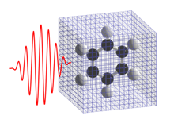

Sandbox
=======================

Image
-----------

List and Link
---------------------

* :any:`install_and_run`
* `SALMON website <http://salmon-tddft.jp>`_

Code and syntax highlights
-----------------------------

* Example 1::

    subroutine func1(a)
      implicit none
      integer :: a
    end subroutine

* Example 2

  .. code-block:: fortran

    subroutine func2(b)
      implicit none
      real(8) :: b
    end subroutine

Table
------------------

======  ================
Header  Description
======  ================
A       D
B       E
C       F
======  ================

Citation
--------------

- if you use SALMON to calculate electron dynamics in a unit cell of crystalline solid, :cite:`SALMON-unit-cell`: discussing formalism and numerical implementation will be appropriate.
- if you use SALMON for electron dynamics calculations of a large-size system, :cite:`SALMON-large-system`: that discusses massively parallel implementation utilizing spatial divisions will be appropriate.
